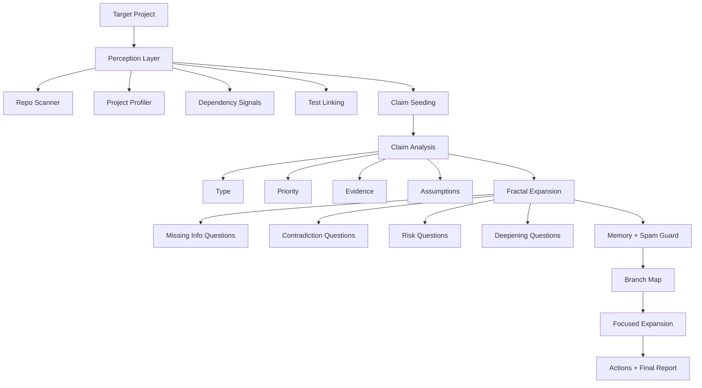

<div align="center">

# 🧠 Apex Orchestrator

### Agents for fractal codebase intelligence

**Scan deeper. Ask better questions. Focus the right branch.**

[](https://www.python.org/)
[]()
[]()
[]()
[]()
[]()
[](LICENSE)

> **Apex Orchestrator** is a branch-aware, memory-aware, supervised engineering agent that evolves toward guarded autonomous coding. It doesn't just read your codebase — it *reasons* about it.

[Quick Start](#quick-start) · [Core Concepts](#what-makes-it-different) · [Automation Plans](#automation-plans) · [Safety](#safety-first) · [Roadmap](#roadmap)

</div>

---

## Why this repo matters

Most code intelligence tools stop too early.

They give you one of these:
- a file tree
- a lint-style issue list
- a one-shot summary
- a vague “looks fine” answer

**Apex Orchestrator goes further.**

It treats a codebase like a living reasoning surface:
- extract structural claims
- challenge those claims
- branch recursively
- preserve memory across runs
- cut low-value recursion
- focus only where the next insight is worth the cost

This is not just repo analysis.
This is **fractal project reasoning**.

---

## What makes it different

### 1. It thinks in branches, not blobs
Instead of one flat summary, the engine builds a branch map such as:

```text
x.a     dependency hub risk
x.a.a   why this hub matters
x.a.b   what evidence could contradict it
x.b     sensitive surface claim
x.b.a   auth/payment expansion
```

### 2. It remembers without going blind
Most systems either:
- forget everything, or
- over-deduplicate and stop exploring

This project uses **degrade-not-block memory**:
- same-run duplicates still stop
- prior-run repeats are degraded, not killed
- important branches can reappear with lower novelty instead of disappearing completely

### 3. It cuts recursive noise
The system includes a spam guard that filters:
- repetitive meta-claims
- generic shell questions
- low-value recursive echoes

### 4. It lets the user steer depth
After a full scan, you can focus a specific branch like:
- `x.a`
- `x.a.b`
- `x.k.b`

and deepen only that subtree.

---

## The pitch in one sentence

**Apex Orchestrator is an agent brain for codebases: it scans, questions, prioritizes, remembers, and deepens the most valuable path instead of stopping at a shallow answer.**

---

## Core capabilities

- project-aware structural scanning
- claim extraction from repository signals
- claim typing and priority scoring
- recursive question generation with constitutional rules
- supporting and opposing evidence mapping
- branch maps like `x.a`, `x.a.b`, `x.c.a`
- persistent agent memory in `.epistemic/memory.json`
- degrade-not-block novelty logic
- branch focus mode
- debug stats for duplicates, memory degradation, spam filtering, and focus hits/misses
- grounded recommended actions
- skill automation plans such as `project_scan`, `focused_branch`, and `verify_project`

---

## How it works



---

## What “fractal” means here

Fractal does **not** mean “keep recursing forever.”

It means every meaningful claim follows a disciplined loop:

1. derive a claim
2. classify and prioritize it
3. generate four mandatory question classes
4. search for supporting and opposing evidence
5. evaluate risk, quality, novelty, and security
6. expand only if the branch deserves more budget
7. expose not just conclusions, but the confidence structure behind them

---

## Core constitution

1. Do not stop at a single answer; decompose into claims.
2. For every claim, generate four mandatory question classes.
3. Search for counter-evidence against current conclusions.
4. Mark under-supported claims as low confidence.
5. Do not deepen a branch without security, quality, and verifiability checks.
6. Cut repetitive or low-value branches.
7. Tie expansion to budget and novelty thresholds.
8. Show the confidence structure, not only the final conclusion.

---

## Quick start

```bash
python -m venv .venv
source .venv/bin/activate
pip install -e .[dev]
pytest
python -m app.main
```

Run against another project:

```bash
export EPISTEMIC_TARGET_ROOT=/absolute/path/to/your/project
python -m app.main
```

Run with skill automation:

```bash
export EPISTEMIC_TARGET_ROOT=/absolute/path/to/your/project
export EPISTEMIC_AUTOMATION_PLAN=project_scan
python -m app.main
```

Verify a project quickly:

```bash
export EPISTEMIC_TARGET_ROOT=/absolute/path/to/your/project
export EPISTEMIC_AUTOMATION_PLAN=verify_project
python -m app.main
```

Focus a branch:

```bash
export EPISTEMIC_TARGET_ROOT=/absolute/path/to/your/project
export EPISTEMIC_AUTOMATION_PLAN=focused_branch
export EPISTEMIC_FOCUS_BRANCH=x.a.b
python -m app.main
```

---

## Demo project

A synthetic project is included under `examples/synthetic_shop`.
It is intentionally small, centralized, partially tested, and includes auth/payment/config surfaces so the engine has something meaningful to find.

```bash
export EPISTEMIC_TARGET_ROOT=$(pwd)/examples/synthetic_shop
export EPISTEMIC_AUTOMATION_PLAN=project_scan
python -m app.main
```

Then deepen one branch:

```bash
export EPISTEMIC_TARGET_ROOT=$(pwd)/examples/synthetic_shop
export EPISTEMIC_AUTOMATION_PLAN=focused_branch
export EPISTEMIC_FOCUS_BRANCH=x.a
python -m app.main
```

---

## Output you should expect

A successful run should surface things like:
- dependency hub claims
- sensitive surface claims
- validation gaps and critical untested modules
- configuration and CI signals
- branch maps and branch questions
- recommended actions grounded in real files
- a persistent memory file at `.epistemic/memory.json`

---

## Skill automation

The repo now supports plan-based skill automation.

### `project_scan`
Runs a structured sequence:
1. profile project
2. decompose objective
3. run research orchestrator

### `focused_branch`
Runs focused research using the selected branch from memory.

### `verify_project`
Runs a quick verification loop:
1. profile project
2. execute detected test commands

This moves the system from “a collection of skills” toward “an automation backbone.”

---

## Current architecture snapshot

```text
app/
├── automation/      # skill registry, plans, runner, adapters
├── engine/          # budget, novelty, termination, execution loop
├── memory/          # graph store and persistent memory
├── models/          # nodes, questions, reports, enums
├── policies/        # constitution and scoring
├── runtime/         # workspace, git, command foundation
├── skills/          # reasoning, execution, safety
├── tools/           # repo scanner, project profiler, dependency signals
└── utils/           # support utilities

config/
└── *.yaml

tests/
└── test_*.py

examples/
└── synthetic_shop/

docs/
└── branding.md
```

---

## Roadmap

### Completed
- ✅ stabilize automation, memory, spam guard, and branch focus
- ✅ semantic patch generation (AST-based, no LLM required)
- ✅ retry repair loop with controlled retry budget
- ✅ git diff / commit / PR summary closing loop
- ✅ token telemetry with budget enforcement
- ✅ compressed operator mode for token efficiency
- ✅ modular LLM router (default: none, optional: openai/local)

### Next
- stronger safety governor (max line diff, restricted paths, review policies)
- multi-model routing and cost-aware provider selection
- IDE / MCP server integration
- community docs and contribution guidelines

### Later
- full autonomous workflow with self-directed research + patch + PR
- multi-agent swarm coordination
- advanced AST transforms (refactor, extract, inline)

---

## Project status

**Current state:** strong internal alpha → beta transition

Today it is strongest as:
- repo intelligence engine with fractal reasoning
- memory-aware planning and branch-focused research agent
- **supervised autonomous coding agent** (semantic patch + retry + git/PR)
- token-budget-aware execution system
- optional LLM integration without mandatory external dependencies

It can now run end-to-end: research → plan → patch → verify → retry → commit → PR summary.

---

## Why star or follow this repo

If you care about:
- agent engineering
- memory-aware repo intelligence
- recursive reasoning systems
- branch-directed project analysis
- building toward safe autonomous coding agents

this repo is building exactly in that direction.

---

## License

Licensed under **Apache-2.0**.
