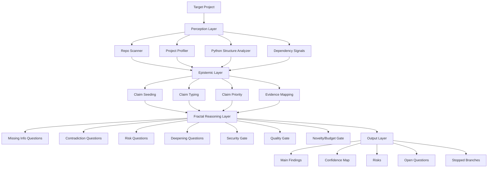

# Epistemic Orchestrator

A constitutional **fractal project intelligence engine** for codebases.

Instead of stopping at a flat answer, Epistemic Orchestrator scans a project, derives structural claims, classifies and prioritizes them, generates recursive follow-up questions, searches for supporting and opposing evidence, and expands only the highest-value branches.

## Why this project exists

Most project analyzers stop at one of these layers:

- static file listing
- symbol extraction
- lint-style findings
- one-shot LLM summaries

Epistemic Orchestrator is designed to go further:

- **structure-first**: understand the repository as a graph, not a folder dump
- **constitution-driven**: every expansion is constrained by explicit rules
- **fractal**: every meaningful claim can generate deeper sub-questions
- **risk-aware**: contradictory evidence, security, quality, novelty, and budget gates matter
- **memory-aware**: the agent can remember prior runs without becoming blind to repeated but still important branches
- **branch-focus aware**: the user can ask the engine to deepen one exact fractal branch such as `x.a` or `x.b.c`
- **action-oriented**: the end state is not just insight, but useful engineering direction

## What “fractal” means here

Fractal does **not** just mean recursively scanning files.
It means the engine follows a mathematical and constitutional pattern:

1. derive a claim
2. classify and prioritize it
3. generate four mandatory question classes
4. search for supporting and opposing evidence
5. evaluate risk, quality, novelty, and security
6. expand only if the branch is worth expanding
7. surface not just conclusions, but the confidence structure behind them

## Core constitution

1. Do not stop at a single answer; decompose into claims.
2. For every claim, generate four mandatory question classes.
3. Search for counter-evidence against current conclusions.
4. Mark under-supported claims as low confidence.
5. Do not deepen a branch without security, quality, and verifiability checks.
6. Cut repetitive or low-value branches.
7. Tie expansion to budget and novelty thresholds.
8. Show the confidence structure, not only the final conclusion.

## Architecture overview



## Current capabilities

- project-aware claim seeding from repository structure
- heuristic claim typing and priority scoring
- local project evidence scanning
- lightweight Python import and symbol extraction
- dependency hub and symbol density signals
- untested module heuristics
- grounded recommended actions
- agent memory stored under `.epistemic/memory.json`
- memory-aware novelty scoring with **degrade-not-block** behavior
- branch map output such as `x.a`, `x.a.b`, `x.c.a`
- branch focus mode for user-directed deepening
- debug stats for duplicate blocking, memory degradation, spam filtering, and focus-branch hits/misses
- recursive question generation with constitutional gates
- final synthesis with confidence map and prioritized findings
- test suite + GitHub Actions CI

## Repository layout

```text
app/
├── engine/          # budget, novelty, termination, execution loop
├── memory/          # graph store and persistent agent memory
├── models/          # nodes, questions, reports, enums
├── policies/        # constitution and scoring
├── skills/          # decomposer, validator, claim analyzer, synthesizer
├── tools/           # repo scanner, project profiler, dependency signals
└── utils/           # support utilities

config/
└── *.yaml           # engine, routing, and policy config

tests/
└── test_*.py        # core verification suite

examples/
└── synthetic_shop/  # intentionally imperfect demo project
```

## How it works

### 1. Perception
The engine scans the target repository and extracts structural signals:

- file types
- top directories
- entrypoints
- tests
- CI/workflows
- config surfaces
- sensitive paths
- Python imports and symbols

### 2. Claim seeding
Those signals are transformed into initial claims such as:

- dependency hub claim
- symbol density claim
- testing gap claim
- automation claim
- sensitive surface claim
- configuration claim

### 3. Claim analysis
Each claim is enriched with:

- claim type
- claim priority
- claim signals
- evidence for / against
- assumptions
- risk score
- fractal branch path like `x.a`, `x.a.b`, `x.c.a`

### 4. Fractal expansion
For every viable claim, the engine generates four mandatory question classes:

- missing-information questions
- contradiction questions
- risk questions
- deepening questions

Then it decides whether to expand or stop the branch.

### 5. Agent memory
The orchestrator writes persistent project memory under `.epistemic/memory.json`.
This memory stores prior claims, prior questions, recent runs, and branch history.

Important behavior:

- repeated items within the **same run** are still blocked
- repeated items from **prior runs** are **degraded**, not blocked outright
- low-value recursive noise is still filtered by the spam guard

### 6. Branch focus mode
After a normal run, the report includes a `branch_map` and `branch_questions` section.
You can reuse one of those branch paths in a later run to deepen only that branch.

Behavior:

- if the branch exists in agent memory, the focused run starts from that exact claim
- descendants continue underneath the same prefix, for example `x.b.c`, `x.b.c.a`, `x.b.c.b`
- if the branch does not exist, the system falls back to a normal full scan and records a focus miss in `debug_stats`

### 7. Synthesis
The final report contains:

- main findings
- claim types
- claim priorities
- branch map and branch questions
- confidence map
- strongest supporting evidence
- strongest opposing evidence
- assumptions
- unresolved questions
- stopped branches
- recommended actions
- memory metadata and debug stats
- optional focus branch metadata

## Quick start

```bash
python -m venv .venv
source .venv/bin/activate
pip install -e .[dev]
python -m app.main
pytest
```

To run against another project:

```bash
export EPISTEMIC_TARGET_ROOT=/absolute/path/to/your/project
python -m app.main
```

## Try the demo project

A synthetic project is included under `examples/synthetic_shop`.
It is intentionally small, centralized, partially tested, and contains sensitive/auth/payment surfaces so the orchestrator has something meaningful to find.

Run the engine against it like this:

```bash
export EPISTEMIC_TARGET_ROOT=$(pwd)/examples/synthetic_shop
python -m app.main
```

Run it a second time against the same project to observe agent memory behavior.
The report should keep branching alive while showing memory-related degradation counters in `debug_stats`.

Then focus one branch:

```bash
export EPISTEMIC_TARGET_ROOT=$(pwd)/examples/synthetic_shop
export EPISTEMIC_FOCUS_BRANCH=x.a
python -m app.main
```

What you should expect to see in the report:

- dependency hub claims around `order_service.py`
- sensitive surface claims around auth/payment files
- validation gap or untested module claims
- configuration and automation-related signals
- a `.epistemic/memory.json` file created in the target project
- focused runs whose branch keys stay under the selected prefix

## Recommended usage modes

### Scan mode
Fast structural overview of a project.

Use it for:
- onboarding a new repo
- high-level architectural review
- quick technical risk discovery

### Audit mode
Deeper analysis of validation, security, configuration, and dependency pressure.

Use it for:
- release readiness checks
- technical debt review
- engineering health scans

### Expansion mode
Focused recursive analysis of one branch.

Use it for:
- auth module inspection
- payment flow review
- CI gap analysis
- entrypoint risk analysis
- branch-directed deepening such as `x.a.b`

## Example analysis themes

- Which dependency hubs are central and under-tested?
- Which sensitive modules appear early in the expansion tree?
- Which entrypoints create architectural coupling risk?
- Which config surfaces likely hide environment assumptions?
- Which subsystems deserve the next engineering investment?
- Which specific branch should be deepened next?

## Roadmap

### Near term
- evidence anchors with precise traceability
- richer contradiction generation
- patch and test suggestion scaffolds
- stronger e2e regression coverage

### Mid term
- refactor/test suggestion engine
- patch candidate generation
- host adapters for Claude Code / opencode
- richer branch-focused user-directed expansion

### Later
- semantic retrieval
- graph-aware expansion strategies
- richer persistent memory policies
- longitudinal project change analysis

## License

Licensed under **Apache-2.0**.

A detectable license file is included so GitHub can display the license clearly for the repository.
